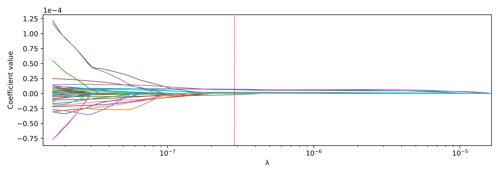

# Volatility Forecasting with Shrinkage Estimators

&#x20;

## Table of Contents

1. [Overview](#overview)
2. [Features](#features)
3. [Requirements](#requirements)
4. [Usage](#usage)
5. [Thesis Summary](#thesis-summary)
6. [Thesis Structure](#thesis-structure)
7. [Other](#other)

## Overview

This repository provides the Python implementation for forecasting realized variance using four model specifications, matching the analyses in my Bachelor's Thesis at the Chair of Statistics and Risk Management, Prof. Dr. Daniel Rösch, at the University of Regensburg:

**Volatility Forecasts for Foreign Exchange Markets with Shrinkage Estimators**

The core deliverable is a class `UnifiedVolForecast` that supports:

- HAR (Heterogeneous Autoregressive)
- HExp (Truncated Heterogeneous Exponential)
- Lasso-HAR (Lasso-regularized HAR)
- Lasso-HExp (Lasso-regularized HExp)

## Features

- **Modular Forecasting Framework**: Plug-and-play forecasting for multiple model types.
- **Rolling-Window & Cross-Validation**: Strict out-of-sample evaluation with time-series CV.
- **Comprehensive Metrics**: Automatic calculation of QLIKE, MSE, RMSE, MAE, R², Mincer–Zarnowitz R², Durbin–Watson.
- **Visualization Tools**: Built-in plotting functions for both in-sample fit and out-of-sample forecasts.
- **Configurable Lasso Regularization**: Tune lag selection and penalization via parameters.
- **Extensible Design**: Easily integrate additional models or performance metrics.

## Thesis Summary

This thesis investigates whether Lasso-based regularization enhances out-of-sample forecasting performance of classical heterogeneous volatility models in high-frequency foreign exchange markets. Key contributions include:

1. **Motivation & Context**

   - Volatility forecasting is fundamental for risk management, derivative pricing, and trading strategies.
   - Traditional models like HAR capture long memory via fixed daily, weekly, and monthly realized variance components but lack flexibility under structural shifts.

2. **Methodological Innovations**

   - Extend HAR and exponentially weighted HExp models by embedding Lasso shrinkage, yielding **Lasso-HAR** and **Lasso-HExp**.
   - Allow data-driven selection of up to 100 lagged variance predictors, subject to non-negativity constraints.
   - Implement rolling-window estimation with localized time-series cross-validation to tune the penalty parameter.

3. **Data & Experimental Design**

   - Ten years (2012–2022) of one-minute realized variance for EUR/USD, GBP/USD, USD/JPY.
   - Forecast horizons: 1-day, 5-day, and 22-day ahead aggregated RV.
   - Models re‑estimated each forecast origin over a 1,000-day rolling window; forecasts evaluated on strictly out-of-sample data.

4. **Empirical Findings**

   - **Short-term gains**: Lasso-HExp achieves the lowest QLIKE at the 1-day horizon for EUR/USD and GBP/USD, indicating improved distributional calibration.
   - **Horizon-dependence**: Regularization benefits diminish at 5- and 22-day horizons; unpenalized HExp often outperforms in MSE/RMSE beyond short horizons, especially for USD/JPY.
   - **Lag selection patterns**: Both Lasso variants emphasize recent lags (1–5 days), with occasional inclusion of longer-term lags up to 100 days that vary by horizon and currency.
   - **Statistical tests**: Diebold–Mariano comparisons yield no consistent, significant superiority of penalized models across all settings.

5. **Conclusions & Implications**

   - Lasso-based shrinkage offers flexibility and improves short-horizon volatility forecasts in select FX pairs.
   - No universal advantage: efficacy depends on forecast horizon, currency dynamics, and volatility regimes.
   - Future research directions include alternative penalty selection schemes, incorporating exogenous predictors (returns, macro indicators), and non-linear model extensions.

## Thesis Structure

1. **Introduction**

2. **Theoretical Foundations**

   - 2.1 Realized Variance
   - 2.2 Forecasting Models
     - 2.2.1 HAR Model
     - 2.2.2 HExp Model
   - 2.3 Shrinkage Estimators (Lasso Extensions)
   - 2.4 Forecasting Framework & Evaluation

3. **Foreign Exchange Markets Data**

4. **Empirical Analysis**

   - 4.1 Implementation
   - 4.2 In-Sample Results
   - 4.3 Out-of-Sample Results

5. **Conclusion**

6. **Bibliography**

## Requirements

- Python 3.8 or higher
- Packages: `numpy`, `pandas`, `scikit-learn`, `statsmodels`, `matplotlib`

## Usage

### 1. Prepare data

Provide a Pandas DataFrame `df` with:

- A DateTime index
- A column for realized variance (e.g., `eurusd_rv`)

### 2. Instantiate the forecaster

```python
from src.vol_forecast import UnifiedVolForecast

forecaster = UnifiedVolForecast(
    df=df,
    target_col="eurusd_rv",
    model_type="HAR",       # Options: HAR, HExp, LASSO-HAR, LASSO-HEXP
    flex_threshold=100,       # For LASSO: maximum lag span p
    lasso_cv=10,              # Number of folds for LassoCV
    lasso_max_iter=100000     # Max iterations for Lasso solver
)
```

### 3. In-sample evaluation

```python
ins_metrics = forecaster.in_sample_fit()
print(ins_metrics["in_sample"])
print(forecaster.in_sample_model_details)
forecaster.plot_in_sample()
```

### 4. Rolling out-of-sample forecasting

```python
horizon = 5         # Forecast horizon in days
window_size = 1000  # Rolling window length
step_size = horizon

oos_df = forecaster.rolling_forecast(
    window_size=window_size,
    horizon=horizon,
    step_size=step_size
)
```

### 5. Compute out-of-sample metrics

```python
oos_metrics = forecaster.evaluate_forecasts()
print(oos_metrics[f"{horizon}d"])
```

### 6. Visualize forecasts

```python
forecaster.plot_forecast(horizon=f"{horizon}d")
```

## Example Forecasts

Below are sample forecast plots generated by the different models. Replace these with your own figures in `figures/`.

EUR/USD - HAR Model - 5d Forecast Horizon


EUR/USD - HEXP Model - 1d Forecast Horizon


## Other

For direct queries, or more sophisticated questions about the thesis and it's Implementation in Python, don't hesitate to contact Me at [david.harrieder@stud.uni-regensburg.de](mailto\:david.harrieder@stud.uni-regensburg.de)

